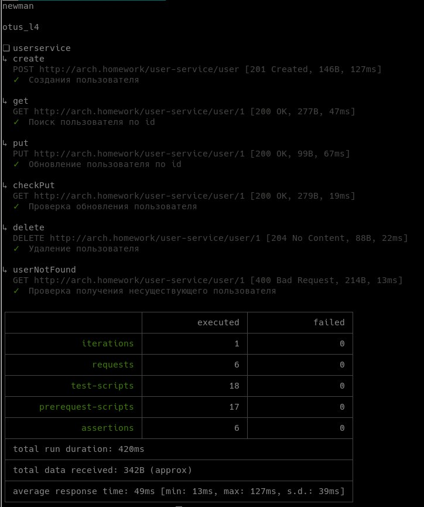

### Запуск приложения

```shell
kubectl create namespace abdalovalex && helm install user-service user-service --namespace abdalovalex
```

1. До установки запускаются следующие ресурсы:
   1. Запуск БД
   2. Установка ConfigMap и Secret
   3. Запуск Job c миграциями. Job ждет запуска БД.
2. Запуск Deployment

Для порядка запуска используются initContainer и helm hook.  
ConfigMap и Secret забирает приложение(инструмент SpringCloudKubernetes), для этого создан ServiceAccount 
с ограниченными ролями для приложения.  
API доступно по адресу: http://arch.homework/user-service/user  

### Запуск тестов
```shell
newman run ./tests/tests.json
```



### Удаление
```shell
kubectl delete namespace abdalovalex
kubectl delete clusterrolebinding user-service
kubectl delete clusterrole user-service 
```
